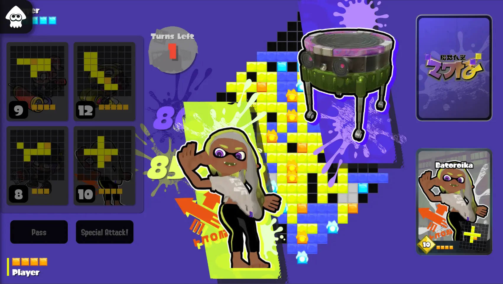

# tableturf-replica

`tableturf-replica` is a fan-made game aims at reproducing the original game in a portable way with html5. Almost done, but still needs some polishing.

## Try it Out!

Visit [main page](https://tableturf.koishi.top)

## Preview

## Custom Bot

Check demo project: [fga401-bot-adapter](https://github.com/xlnx/fga401-bot-adapter)

## Ref Frameworks

* **Bundler**: [Vite](https://vitejs.dev/)
* **Rendering**: [pixi-js](https://pixijs.com/)
* **Dialogs**: [React](https://reactjs.org/)
* **State Management**: [boardgame.io](https://boardgame.io/)
* **P2P**: [PeerJs](https://peerjs.com/)
* **Python API**:
  * [js2py](https://github.com/PiotrDabkowski/Js2Py)
  * [jsonrpc](https://www.jsonrpc.org/specification)
  * [websocket](https://developer.mozilla.org/en-US/docs/Web/API/WebSocket)
