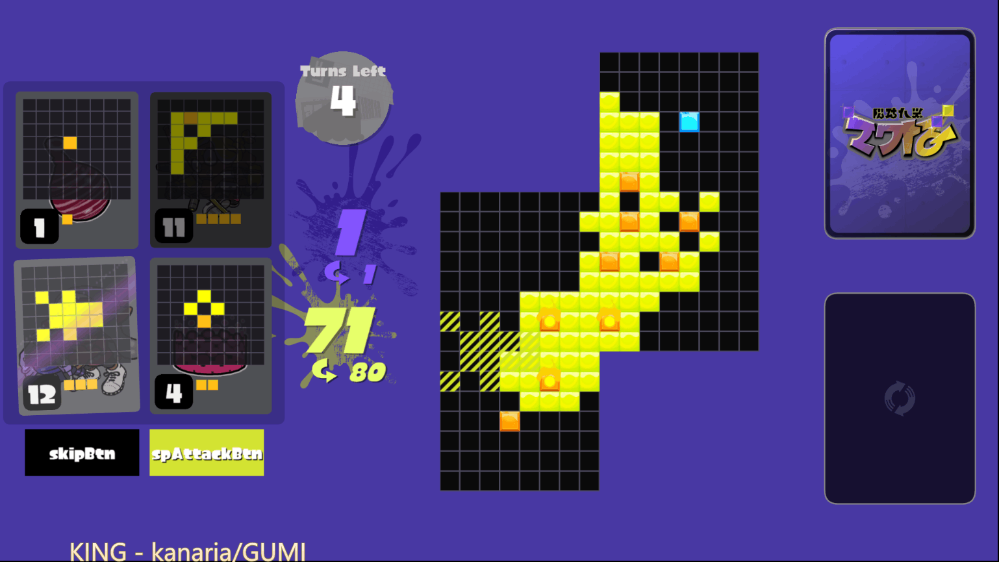

# tableturf-replica


`tableturf-replica` is a fan-made game aims at reproducing the original game in a portable way with html5.

## Ref Frameworks

* **Bundler**: [Vite](https://vitejs.dev/)
* **Rendering**: [pixi-js](https://pixijs.com/)
* **Dialogs**: [React](https://reactjs.org/)
* **State Management**: [boardgame.io](https://boardgame.io/)
* **P2P**: [PeerJs](https://peerjs.com/)

## Current Status

* **Rendering**: almost there.
* **User Interactions**: works.
* **Bots**: not implemented yet.
* **P2P**: WIP.

## Getting Started

```bash
yarn install
yarn dev
```

## Preview



